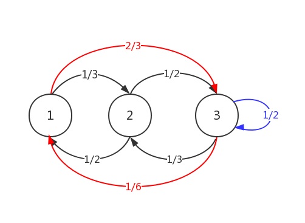

# 马尔科夫链

本节介绍马氏链（MC）的概念和性质。本文仅考虑有限离散时间过程。

## 1. MC基础

定义一个随时间变化的**过程**， 令$X_t$ 表示一个随机变量，$t$为正整数。将该过程限定在某系统内部，系统包含不同的**状态** $\mathcal{S}$, 也即是

$$X_t\in \mathcal{S}$$ 

假设各状态之间的切换时随机的，就得到一个随机过程。如果某时刻$t$的状态为$i$，则记为$X_t=i$. 从状态$i$到状态$j$的一步**转移概率**记为$p_{ij}$ . 这个概率是不随时间而变化的。

**马尔科夫过程**：从状态$i$转换到状态$j$ 的概率和状态$i$之前的状态无关，即：
$$
P(X_{t+1}=j|X_t=i, X_{t-1}=i_{t-1}, \cdots, X_1=i_1, X_0=i_0)= P(X_{t+1}=j|X_t=i) = p_{ij}\tag{1}
$$
设$p_{ij}^n$ 代表第$n$步从状态$i$转移到状态$j$的概率。对有限步数$n$，若$p_{i,j}^n>0$，则称从状态$i$到状态$j$**可达**。 当两个状态相互可达时，称他们**互通**。

转移概率$p_{i,j}^n$将MC分为不同的互通类：对那些互通的状态，意味着每个状态只能属于一个集合，称之为**闭合类**。 如果所有的状态都是互通的，则这种过程仅包含一个类，这样的链是**不可约**的。

当然，常规的概率约束对转移概率同样有效，比如$p_{ij}>0$, $\sum_{j=0}^{\infty}p_{ij}=1$等等。 我们同时约定$X_t$的值为正整数。 我们称满足上述性质的随机变量$X_0, X_1, X_2,...$ 构成一个**马尔科夫链** $X$. 

假设重返状态$i$的概率为$f_i$，如果$f_i=1$, 则称状态$i$为**循环状态**，如果$f_i<1$则称状态$i$为**过渡状态**。循环状态意味着无限次地转移到自身状态，没有任何一个状态可以吸收这个过程，所以也称为**吸收状态**。另一方面，对于过渡状态$j$而言，每次到达此状态时，该到达是最后一次的概率为一个正数$1-f_j$。 也就是说，到达过渡状态的次数是有限的。  显然，如果MC是有限的，则意味着不可能所有的状态都是过渡状态，必须至少包含一个吸收态。

如果从循环态$i$开始，到回到循环态期望的时间是有限的，则称状态$i$是**正循环**。如果一个状态$i$经过有限次步数$d(i)$后能回到该状态，则称此状态是**周期**的。其中$d$是满足$d>1$的正整数。如果$d=1$则说该状态是非周期的。如果状态既是非周期的，又是正循环的，则称状态是**遍历**的。 

**例1**： 如果有一个三状态的马氏链，包含的状态为$\{1,2,3\}$,且转移概率如图1所示： 

图1：马氏链的例子

其相应的转移矩阵为：
$$
P=\left(
\begin{matrix}
0 & 1/3 & 2/3 \\
1/2 & 0 & 1/2 \\
1/6 & 1/3 & 1/2
\end{matrix}
\right) \tag{2}
$$
不难发现该MC是遍历和不可约的。

## 2. Chapman-Kolmogorov方程

从上节知道，我们定义$p_{ij}^n$为在$n$步内从状态$i$转移到状态$j$的概率。即
$$
p_{ij}^n=P(X_n=j|X_0=i)\tag{3}
$$
$n\ge 1$. 利用第一全概率法则和马尔科夫性质，可以得到：
$$
\begin{split}
p_{ij}^n&=P(X_n=j|X_0=i)\\
&=\sum_{k\in K}P(X_n=j, X_r=k|X_0=i)\\
&=\sum_{k\in K}P(X_n=j|X_r=k, X_0=i)P(X_r=k|X_0=i)\\
&=\sum_{k\in K}P(X_n=j|X_r=k)P(X_r=k|X_0=i)\\
&=\sum_{k\in K}p_{ik}^rp_{kj}^{n-r}
\end{split}\tag{4}
$$
$K$是所有可能状态的集合。$r$是一个非负整数，$r<n$. 我们称(4)式为Chapman-Kolmogorov方程。 其实质是$n$步内从状态$i$转移到状态$j$的概率等于经过中间步数$k$从状态$i$到状态$j$的概率之和。

我们现在用矩阵相乘的方式表示$n$步转移过程。设$P^{(n)}$表示$n$步转移的概率，则方程(4)等价于$P^{(n)}=P^{(r)}P^{(n-r)}$. 利用诱导公式，有
$$
P^{(n)}=P^n\tag{5}
$$
也就是说，$n$步转移概率等于$n$个一步转移概率的乘积。

考虑图一所示的MC， $P(X_{t+2}=3|X_t=1)=P_{1,3}^2=1/2$.
$$
P^2=\left(
\begin{matrix}
0.28 & 0.22& 0.50 \\
0.08 & 0.33 & 0.58 \\
0.25 & 0.22 & 0.53
\end{matrix}
\right)
$$
这个结论可以用逐步计算来 验证：从A到C有两种途径，$\{A\to B\to C, A\to C\to C\}$,概率可以计算为：$\frac{1}{3}\frac{1}{2}+\frac{2}{3}\frac{1}{2}=\frac{1}{2}$.

## 3. 击中时

将**击中时**定义为随机过程进入某个非空的状态集合${C}\subset\mathcal{S}$ 的首次时间，假设${C}$是一个闭合互通类。现在，假设我们有一个状态集合$\mathcal{S}$上的时间离散马氏链$X$，令${C}\subset \mathcal{S}$是用于$X$ 的闭合互通类。定义集合$C$上的**吸收时间 **$\tau^C\in \mathbb{N}$为：
$$
\tau^C=
\begin{cases}
\min \{t\ge0:X_t\in C \}   &\text{if $X_t\in C$ for some $t\ge0$}\\
\infty& \text{otherwise}
\end{cases}
\tag{6}
$$
从状态$i$开始进入状态集合$C$的吸收概率定义为：
$$
\begin{split}
h_i^C=&P(\tau^C<\infty|X_0=i)\\
=&P(\exist t<\infty:X_t\in C|X_0=i)\\
:=&P(X_t\in C|X_0=i).
\end{split}
$$
下面，为了求解一个概率向量$h^C=(h_i^c, h_2^C,...)$，我们建立如下的线性方程组：
$$
\begin{cases}
h_i^C=1&\text{if $i\in C$}\\
h_i^C=\sum_{j\in \mathcal{S}}p_{ij}h_j^{C}&\text{if $i\notin C$.}
\end{cases}
$$
